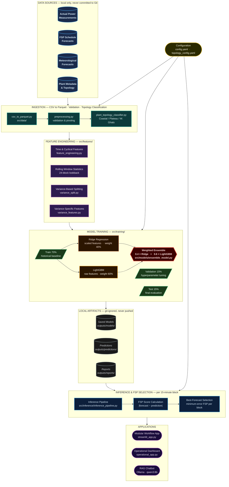

# GKFS FSP Scheduler

A Python and Streamlit-based forecasting workflow for evaluating Forecasting Service Provider (FSP) schedules and selecting the optimal wind power forecast for grid scheduling operations.

---

## Data Governance

This repository contains source code only. Company data, operational datasets, trained models, experiment runs, and generated artifacts must not be committed to version control under any circumstances.

Paths permanently excluded by `.gitignore`:

| Path | Contents |
|------|----------|
| `data/` | All raw and processed datasets (CSV, Parquet) |
| `outputs/` | Trained model artifacts, predictions, plots, reports |
| `model_savesss/` | Per-plant model saves |
| `mlruns/` | MLflow experiment tracking runs |
| `perf_rpt/` | Operational performance report exports |
| `notebooks/` | Jupyter notebooks |

All `*.csv`, `*.parquet`, `*.xlsx`, `*.pkl`, `*.joblib`, `*.h5`, and generated image files are also excluded globally.

All company data must remain on the local machine or an approved internal storage system.

---

## Architecture



---

## Repository Structure

```text
GKFS-FSP-Scheduler/
├── app/
│   ├── pages/
│   │   ├── data_selection.py         Plant and data loading with gap visualisation
│   │   ├── feature_engineering.py    Interactive feature creation
│   │   ├── fsp_selection.py          FSP selection logic and results
│   │   ├── model_comparison.py       Side-by-side model performance comparison
│   │   ├── model_training.py         Training UI with hyperparameter controls
│   │   └── predictions_viz.py        Prediction visualisation and analysis
│   └── utils/
│       ├── model_builders.py         Ensemble and deep learning model builders
│       ├── ollama_insights.py        AI-assisted insights generation
│       └── page_summary.py           Page context and summary rendering
├── configs/
│   ├── config.yaml                   Primary project configuration
│   └── topology_config.yaml          Plant topology classification settings
├── docs/
│   ├── OPERATIONAL_UI_DOCUMENTATION.md
│   └── PLANT_TOPOLOGY_CLASSIFICATION.md
├── src/
│   ├── analysis/
│   │   ├── plant_topology_classifier.py   Geographic and elevation-based classification
│   │   └── wind_variance_analysis.py      Wind variability pattern analysis
│   ├── data/
│   │   ├── csv_to_parquet.py         CSV ingestion and per-plant conversion pipeline
│   │   ├── preprocessing.py          Data validation and column pivoting
│   │   ├── variance_split.py         Variance-category dataset splitting
│   │   └── run_all_plants.py         Batch runner for all-plant CSV processing
│   ├── evaluation/
│   │   └── variance_evaluation.py    Evaluation metrics for variance models
│   ├── features/
│   │   ├── feature_engineering.py    Time-based, categorical, and rolling features
│   │   └── variance_features.py      Variance-specific feature creation
│   ├── inference/
│   │   └── inference_pipeline.py     Model loading and prediction generation
│   ├── models/
│   │   ├── ensemble_model.py         Ridge and LightGBM ensemble definition
│   │   └── sequence_models.py        LSTM and GRU sequence model definitions
│   └── training/
│       ├── train_ensemble_models.py              Base ensemble training
│       ├── train_ensemble_models_seasonal.py     Seasonal ensemble (v1)
│       ├── train_ensemble_models_seasonal_v2.py  Seasonal with quantile regression
│       ├── train_ensemble_models_seasonal_v3.py  Seasonal with weighted ensembles
│       ├── train_ensemble_models_variance_v4.py  Variance-aware ensemble training
│       ├── train_ensemble_models_variance_v4_optimized.py  Optimised variance training
│       ├── train_models.py                       Alternative training pipeline
│       ├── train_models_v2.py                    Training pipeline v2
│       ├── train_variance_temporal_split.py      Temporal-split variance training
│       └── train_and_save_models_standalone.py   Standalone multi-plant trainer
├── tests/
│   ├── test_data_processing.py       Data pipeline unit tests
│   ├── test_gui_workflow.py          GUI workflow integration tests
│   ├── test_streamlit_app.py         Streamlit application tests
│   ├── train_and_save_ensemble.py    Ensemble training verification
│   └── verify_sample_flow.py         End-to-end sample flow check
├── launch_app.py                     Dependency-checking Streamlit launcher
├── operational_app.py                Operational Streamlit dashboard
├── run_pipeline.py                   CLI pipeline orchestrator
├── streamlit_app.py                  Modular application entry point
└── requirements.txt                  Python dependencies
```

Local-only directories (`data/`, `outputs/`, `model_savesss/`, `mlruns/`, `perf_rpt/`, `notebooks/`) are excluded from version control.

---

## Setup

### Prerequisites

- Python 3.9 or higher
- pip

### Installation

```bash
python -m venv .venv

# Windows
.venv\Scripts\activate

# Linux / macOS
source .venv/bin/activate

pip install -r requirements.txt
```

### Local Data Setup

Place source data files under `data/raw/` (these are ignored by Git and must not be committed):

```
data/
└── raw/
    ├── actualdata.csv
    ├── scheduledata.csv
    └── forecastdata.csv
```

---

## Running the Applications

**Modular workflow application:**
```bash
streamlit run streamlit_app.py
```

**Operational dashboard:**
```bash
streamlit run operational_app.py
```

**Dependency-checking launcher:**
```bash
python launch_app.py
```

---

## Data Processing Pipeline

Convert raw CSV exports into per-plant Parquet datasets:

```bash
python src/data/csv_to_parquet.py --input data/raw --output data/processed
```

Process a single station:

```bash
python src/data/csv_to_parquet.py --input data/raw --output data/processed --station PLANT_NAME
```

Run batch processing for all plants:

```bash
python src/data/run_all_plants.py
```

Run via the CLI orchestrator:

```bash
python run_pipeline.py
```

All generated Parquet and CSV files are saved locally and are excluded from Git.

---

## Model Training

**Standard ensemble (Ridge + LightGBM):**
```bash
python src/training/train_ensemble_models.py
```

**Seasonal ensemble with quantile regression:**
```bash
python src/training/train_ensemble_models_seasonal_v3.py
```

**Variance-aware ensemble:**
```bash
python src/training/train_ensemble_models_variance_v4.py
```

**Standalone multi-plant trainer:**
```bash
python src/training/train_and_save_models_standalone.py
```

**Skip data processing and run training only:**
```bash
python run_pipeline.py --skip-processing
```

Model artifacts, prediction CSVs, and reports are written to `outputs/` which is excluded from Git.

---

## Testing

Run data processing tests:

```bash
python -m pytest tests/test_data_processing.py -q
```

Run the full test suite (requires local model artifacts to be present):

```bash
python -m pytest
```

---

## Configuration

Both configuration files are versioned and must contain non-sensitive settings only.

| File | Purpose |
|------|---------|
| `configs/config.yaml` | Data paths, training ratios, FSP provider list, model hyperparameters |
| `configs/topology_config.yaml` | Plant classification thresholds, elevation API settings, geographic boundaries |

Runtime credentials, private API endpoints, and secrets must be supplied via environment variables or local files excluded by `.gitignore`. Do not commit them.

---

## Git Safety Checklist

Before every push, verify that no data or model artifacts are staged:

```bash
git status --short
git ls-files
```

The tracked file list should contain only source code. Expected safe paths:

- `app/`
- `configs/`
- `docs/`
- `src/`
- `tests/`
- Root Python entry points
- `README.md`, `.gitignore`, `.gitattributes`, `requirements.txt`

If any CSV, Parquet, Excel, pickle, or image file appears, remove it with `git rm --cached <file>` and verify `.gitignore` covers that pattern before pushing.

---

## Remote Repository

```
https://github.com/VeerajSai/GKFS-FSP-Scheduler.git
```

Push to origin:

```bash
git remote add origin https://github.com/VeerajSai/GKFS-FSP-Scheduler.git
git push -u origin main
```

If the remote is already set:

```bash
git remote set-url origin https://github.com/VeerajSai/GKFS-FSP-Scheduler.git
git push
```
