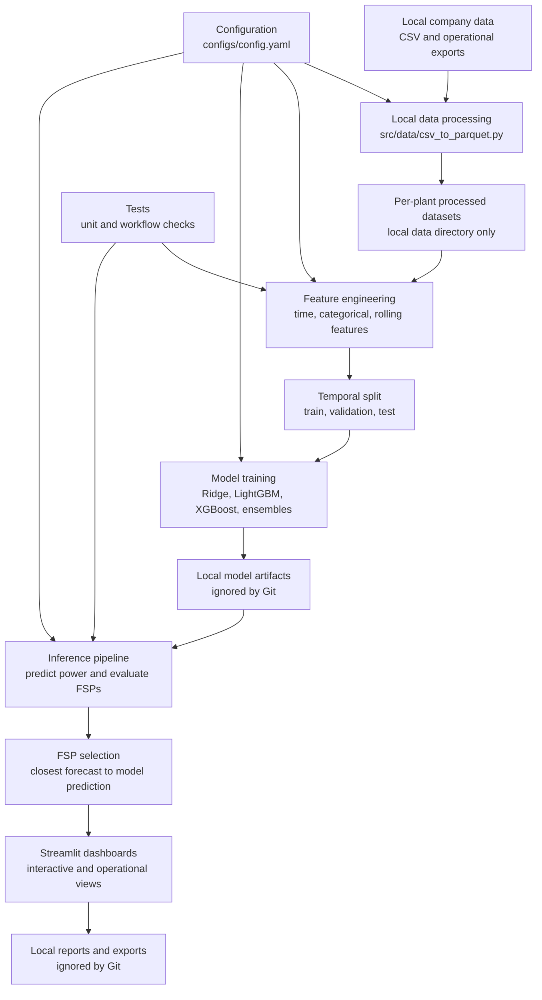

# GKFS FSP Scheduler

GKFS FSP Scheduler is a Python and Streamlit based forecasting workflow for evaluating Forecasting Service Provider schedules and selecting the best available forecast for wind power scheduling operations.

The repository contains application code, training and inference pipelines, configuration, and tests. Proprietary company datasets, generated outputs, trained models, experiment runs, and operational exports are intentionally excluded from Git.

## Data Governance

This repository must not contain company data or datasets.

The following local-only paths are ignored by Git:

- `data/`
- `outputs/`
- `model_savesss/`
- `mlruns/`
- `perf_rpt/`
- `notebooks/`
- generated reports, images, spreadsheets, parquet files, CSV files, and model binaries

Keep all source datasets and generated artifacts on the local machine or an approved internal storage system. Do not upload them to GitHub.

## Architecture



## Repository Structure

```text
app/                 Streamlit page modules and dashboard utilities
configs/             Project configuration files
docs/                Project documentation that is safe to version
src/                 Data processing, features, training, inference, evaluation
tests/               Unit and workflow tests
launch_app.py        Streamlit launcher
operational_app.py   Operational Streamlit dashboard
run_pipeline.py      Command line pipeline runner
streamlit_app.py     Modular Streamlit application entry point
requirements.txt     Python dependencies
```

Local-only directories such as `data/`, `outputs/`, `model_savesss/`, `mlruns/`, `perf_rpt/`, and `notebooks/` are excluded from version control.

## Setup

Create and activate a virtual environment:

```bash
python -m venv .venv
.venv\Scripts\activate
```

Install dependencies:

```bash
pip install -r requirements.txt
```

Prepare local data under `data/raw/` using the approved internal source files:

```text
data/raw/actualdata.csv
data/raw/scheduledata.csv
data/raw/forecastdata.csv
```

These files are ignored by Git and must remain local.

## Running the Applications

Launch the modular Streamlit workflow:

```bash
streamlit run streamlit_app.py
```

Launch the operational dashboard:

```bash
streamlit run operational_app.py
```

Use the helper launcher:

```bash
python launch_app.py
```

## Data Processing

Process raw CSV files into local per-plant datasets:

```bash
python src/data/csv_to_parquet.py --input data/raw --output data/processed
```

Process a specific station:

```bash
python src/data/csv_to_parquet.py --input data/raw --output data/processed --station SAMPLE_PSS
```

The generated parquet and CSV files remain ignored by Git.

## Model Training

Run the standard ensemble training script:

```bash
python src/train_ensemble_models.py
```

Run seasonal model training:

```bash
python src/train_ensemble_models_seasonal_v3.py
```

Run the pipeline helper:

```bash
python run_pipeline.py --skip-processing
```

Model files, prediction outputs, plots, and reports are generated under ignored local artifact directories.

## Testing

Run the focused unit tests:

```bash
python -m pytest tests/test_data_processing.py -q
```

Run the full test suite after installing all optional runtime dependencies and ensuring local model artifacts are present:

```bash
python -m pytest
```

## Configuration

Primary project settings are defined in:

```text
configs/config.yaml
configs/topology_config.yaml
```

These files should contain only non-secret configuration. Runtime secrets, credentials, and private endpoints should be supplied through environment variables or local-only configuration files ignored by Git.

Optional local environment variables:

```text
OLLAMA_BASE_URL=http://localhost:11434
```

## Git Safety Checklist

Before pushing:

```bash
git status --short
git ls-files
git ls-files --others --exclude-standard
```

Confirm that no datasets, model binaries, spreadsheets, generated reports, MLflow runs, or company exports appear in the tracked file list.

Expected safe source areas include:

- `app/`
- `configs/`
- `docs/`
- `src/`
- `tests/`
- root Python entry points
- `README.md`
- `.gitignore`
- `.gitattributes`
- `requirements.txt`

## Remote Repository

Target repository:

```text
https://github.com/VeerajSai/GKFS-FSP-Scheduler.git
```

After reviewing `git status`, create the first commit and push:

```bash
git add .
git commit -m "Prepare repository for source-only release"
git branch -M main
git remote add origin https://github.com/VeerajSai/GKFS-FSP-Scheduler.git
git push -u origin main
```

If `origin` already exists, update it instead:

```bash
git remote set-url origin https://github.com/VeerajSai/GKFS-FSP-Scheduler.git
```
