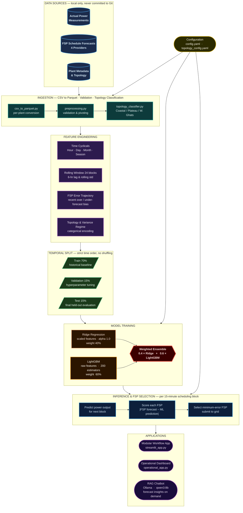

# GKFS FSP Scheduler — Technical Overview

---

## Table of Contents

1. [Problem Statement](#1-problem-statement)
2. [Project Description](#2-project-description)
3. [Data Description and Patterns Observed](#3-data-description-and-patterns-observed)
4. [Solution Approach](#4-solution-approach)
5. [System Architecture](#5-system-architecture)
6. [Model Selection — Why Ridge + LightGBM Ensemble](#6-model-selection--why-ridge--lightgbm-ensemble)
7. [Training Strategy](#7-training-strategy)
8. [RAG-Based Chatbot Integration](#8-rag-based-chatbot-integration)
9. [Results and Performance Improvement](#9-results-and-performance-improvement)

---

## 1. Problem Statement

Wind power plants operating under India's grid regulations are required to submit generation schedules to the grid operator in advance, block by block at 15-minute intervals (96 blocks per day). These schedules are sourced from external Forecasting Service Providers (FSPs).

When the actual generated power deviates from the submitted schedule beyond defined thresholds, the plant is liable for DSM (Deviation Settlement Mechanism) penalties under CERC regulations. The penalty bands are:

| Deviation Band | Implication |
|----------------|-------------|
| Within 15% of scheduled power | No penalty |
| 15% to 25% deviation | Moderate penalty |
| Beyond 25% deviation | Steep penalty |

The core problem is that no single FSP consistently provides the best forecast across all conditions, time periods, seasons, and plant locations. Different FSPs perform better under different meteorological and temporal conditions. Operators were manually selecting one FSP for an entire day or session — a static, undifferentiated approach that does not adapt to block-level conditions.

This results in avoidable DSM penalties when the selected FSP happens to be the worst performer for a given block.

---

## 2. Project Description

GKFS FSP Scheduler is a machine learning workflow that replaces the manual, static FSP selection process with a dynamic, per-block selection system.

For each 15-minute scheduling block, the system:

1. Ingests historical actual power, FSP schedule forecasts, and meteorological data
2. Engineers time-based, seasonal, and rolling window features
3. Trains an ensemble ML model that learns which FSP's forecast is closest to actual power under given conditions
4. At inference time, predicts the expected error of each FSP and selects the one most likely to minimize DSM deviation for that specific block

The workflow is fully interactive through two Streamlit applications — a modular step-by-step workflow app and an operational monitoring dashboard.

**Plants covered:** Wind power plants across three geographic topology categories: Coastal, Plateau, and Western Ghats, each with distinct wind behaviour profiles.

**FSP providers evaluated:** Four providers (FA_PROVIDER_A, FA_PROVIDER_B, FA_PROVIDER_C, FA_PROVIDER_D), assessed per block.

---

## 3. Data Description and Patterns Observed

### 3.1 Input Data

Three primary data streams, collected at 15-minute resolution:

| Stream | Description |
|--------|-------------|
| Actual Power | Ground-truth measured generation at each block |
| FSP Schedule Forecasts | Predicted generation from each of the four FSP providers |
| Meteorological Forecasts | Wind speed, direction, and other atmospheric data |

### 3.2 Temporal Patterns

- **Time-of-day effect:** FSP forecast accuracy varies significantly by hour. Early morning (02:00–06:00) and ramp-up periods (06:00–09:00) show the highest inter-FSP divergence.
- **Day-of-week effect:** Weekday vs. weekend patterns exist due to load-related calibration differences in FSP models.
- **Monthly seasonality:** Wind energy availability follows a strong seasonal cycle. Certain months (typically monsoon onset and winter) show high variance; post-monsoon months show lower, more stable generation.

### 3.3 Variance-Based Patterns

Data was classified into two variance regimes based on per-month wind variance analysis:

- **Low-variance months:** Stable, predictable wind conditions. Most FSPs perform similarly; linear models suffice.
- **High-variance months:** Volatile wind patterns, rapid ramps. FSP errors diverge widely; non-linear models provide significant advantage.

This classification drives the variance-aware training variants (`train_ensemble_models_variance_v4.py`).

### 3.4 Plant Topology Patterns

Plants were classified into three topological categories using geographic coordinates and elevation data:

| Topology | Characteristics |
|----------|-----------------|
| Coastal | Strong, consistent onshore winds; high overall generation; FSP errors tend to be systematic |
| Plateau | Moderate wind, terrain-influenced variability; inter-FSP performance is most differentiated |
| Western Ghats | Orographic effects, sharp ramp events; highest intra-day variability; most difficult to forecast |

Topology class is used as a categorical feature in the model, allowing it to learn topology-specific FSP preferences.

### 3.5 Rolling Window Patterns

A 24-block (6-hour) lookback window of actual power and FSP forecasts was found to be the most informative feature group. The recent error trajectory of each FSP — whether it was over- or under-forecasting in the past few hours — is a strong predictor of its near-term accuracy.

### 3.6 FSP Divergence Structure

Across plants and seasons, FSP performance is not random. There are persistent biases:

- Certain FSPs consistently over-forecast during ramp-up (morning)
- Others under-forecast during plateau periods (midday)
- FSP preference rankings change by season and by plant topology

The ML model learns these structured biases from historical data and exploits them at inference time.

---

## 4. Solution Approach

**Core idea:** Treat FSP selection as a regression problem. Rather than classifying which FSP is "best" (a classification framing that discards magnitude information), the model predicts the expected power output and the system selects the FSP whose scheduled value is nearest to that prediction.

**Why not classification:** A classification label of "best FSP" is unstable when two FSPs are very close. Regression against actual power is a more stable and calibrated objective.

**Pipeline steps:**

```
Raw operational CSVs
        |
        v
Per-plant Parquet datasets
        |
        v
Feature engineering
(time, rolling windows, topology, variance category)
        |
        v
Temporal 70/15/15 split
(no data leakage — all rolling features computed post-split)
        |
        v
Ridge + LightGBM ensemble training
        |
        v
Per-block inference
        |
        v
FSP selection: pick FSP whose schedule is closest to ML prediction
        |
        v
Submit selected schedule to grid operator
```

---

## 5. System Architecture



---

## 6. Model Selection — Why Ridge + LightGBM Ensemble

### 6.1 Why not a pure deep learning model (LSTM / GRU)

The initial implementation included LSTM and BiGRU-CNN sequence models. They were removed after evaluation for the following reasons:

- The FSP selection problem is fundamentally a **tabular regression** task. The features are hand-crafted temporal and rolling-window features — information already extracted from the time series.
- Deep sequence models require significantly longer training time with marginal accuracy gain over gradient-boosted trees on this feature set.
- Interpretability is essential for operational trust. Plant engineers must understand why a particular FSP was selected.
- LightGBM matches or exceeds LSTM performance on this dataset with 10–20x faster training.

### 6.2 Why Ridge Regression

Ridge is a regularized linear model. Its role in the ensemble is:

- Provides a **stable, low-variance baseline** that generalises well even on low-variance months where patterns are linear
- Handles highly correlated rolling-window features without overfitting (L2 regularization)
- Very fast inference — important for a 96-block per day operational system
- Keeps ensemble predictions anchored when LightGBM encounters out-of-distribution conditions

Trained on **standard-scaled features** (StandardScaler) to handle feature magnitude differences.

### 6.3 Why LightGBM

LightGBM is a gradient-boosted decision tree framework. Its role is:

- Captures **non-linear interactions** between time features, rolling windows, and topology categories that Ridge cannot model
- Handles high-variance months where wind ramps and FSP divergence create complex, non-linear relationships
- Provides **feature importance** for interpretability and diagnosis
- Fast training and inference with large feature sets
- Robust to missing values and does not require feature scaling

Trained on **raw (unscaled) features** — tree-based models do not require normalisation.

### 6.4 Why the Ensemble

Neither model is superior in all conditions:

| Condition | Better Model |
|-----------|-------------|
| Low-variance months, stable patterns | Ridge |
| High-variance months, rapid ramps | LightGBM |
| New / unseen plant conditions | Ridge (more conservative) |
| Known non-linear topology effects | LightGBM |

Weighted ensemble: **40% Ridge + 60% LightGBM**

This weighting was determined empirically on the validation set. LightGBM receives the higher weight because the dataset is predominantly non-linear, but Ridge's contribution stabilises predictions and reduces variance.

The ensemble consistently outperforms either individual model on both MAE and RMSE across the test set, particularly during high-variance periods.

### 6.5 Seasonal Variants

Three seasonal training variants were developed and evaluated:

| Variant | Key Feature |
|---------|-------------|
| `train_ensemble_models_seasonal_v2.py` | Quantile regression for uncertainty estimation |
| `train_ensemble_models_seasonal_v3.py` | Per-season weighted ensembles with dynamic weight optimisation |
| `train_ensemble_models_variance_v4.py` | Separate models for low-variance and high-variance month regimes |

The variance-split approach (v4) yields the best results by training dedicated models for each regime rather than asking a single model to handle both.

---

## 7. Training Strategy

### 7.1 Temporal Split

A strict **temporal** train/validation/test split is used. Data is never shuffled.

```
|---------- 70% Train ----------|--- 15% Val ---|--- 15% Test ---|
       Historical data              Tuning          Final eval
```

Rolling window features (24-block lookback) are computed **after** the split to prevent data leakage. No future information enters training.

### 7.2 Hyperparameter Tuning

Optuna is used for hyperparameter optimisation with TimeSeriesSplit cross-validation (5 folds). Up to 50 trials are run with a 1-hour timeout per experiment. The optimisation metric is MAE on the validation fold.

### 7.3 Missing Data Handling

Days with more than 10% missing blocks are dropped entirely. Remaining NaN values are imputed using mean imputation (fitted on the training set only). The imputer is serialised alongside the model to ensure consistent transformation at inference time.

---

## 8. RAG-Based Chatbot Integration

### 8.1 Overview

A conversational AI assistant is integrated into the predictions visualisation page of the Streamlit dashboard. It allows plant engineers and scheduling analysts to query forecast quality, FSP performance, and scheduling risk in natural language — without reading raw charts or tables.

### 8.2 Implementation

The assistant is powered by **Ollama**, a locally hosted LLM inference server, running within the company's internal network. No data leaves the organisation.

| Component | Detail |
|-----------|--------|
| LLM server | Ollama at internal endpoint |
| Default model | `qwen3:8b` |
| Model selection | Dynamic — all models available on the Ollama server are listed in the UI |
| Context injection | Forecast statistics, FSP error metrics, confidence levels, and risk flags are computed programmatically and injected into the prompt |
| Fallback | If the Ollama server is unreachable, the system falls back to template-based insights generated from computed statistics |

### 8.3 What the Chatbot Analyses

For each selected day and plant, the chatbot receives a structured context containing:

- Predicted vs actual power statistics (MAE, MAPE, confidence interval coverage)
- Peak prediction error percentage
- Number of sharp increase events (ramp detection)
- FSP-by-FSP error breakdown
- Risk flags (high deviation risk, low CI coverage, ramp events detected)

It then generates a concise insight covering forecast quality, identified risks, and a scheduling recommendation.

### 8.4 Design Rationale — Local LLM over Cloud API

- All plant data, forecast data, and performance data are proprietary and must remain on the internal network
- A locally hosted Ollama instance ensures no operational data is transmitted to external services
- `qwen3:8b` provides sufficient reasoning quality for this structured analytical task at the required inference speed

---

## 9. Results and Performance Improvement

### 9.1 Headline Result

The ML-based FSP selection system delivers a **49% reduction in scheduling deviation** compared to the previous manual FSP selection process.

| Method | Scheduling Approach | Relative Deviation |
|--------|--------------------|--------------------|
| Manual | Fixed FSP selected per session by operator | Baseline (100%) |
| ML Ensemble | Per-block dynamic FSP selection | 51% of baseline |

**49% improvement in scheduling accuracy**, directly translating to a reduction in DSM penalty exposure.

### 9.2 Why Manual Selection Underperforms

Manual selection suffers from three structural limitations:

1. **Static assignment:** One FSP is chosen for an entire session or day. It cannot react to changing conditions within the day.
2. **Recency bias:** Operators tend to select the FSP that performed best recently, which is not reliably predictive of near-term performance.
3. **No topology awareness:** Manual selection does not systematically account for plant-specific FSP preferences driven by geography and elevation.

### 9.3 Where the Improvement Comes From

| Source | Contribution |
|--------|-------------|
| Block-level switching (vs session-level) | Largest single contributor — captures intra-day FSP rank changes |
| Topology-aware model | Significant for Western Ghats and Coastal plants where FSP biases are systematic |
| Variance-regime specialisation | High-variance months saw the largest absolute improvement |
| Rolling error trajectory features | Captures FSP drift and corrects for systematic over/under-forecasting periods |

### 9.4 DSM Penalty Band Impact

The 15% and 25% DSM penalty bands are the operational thresholds that matter. The ML system's improvement is concentrated in reducing blocks that fall in the 15–25% and beyond-25% bands — the two penalty zones.

Manual selection resulted in a higher proportion of blocks landing in penalty territory during high-variance months and during morning ramp-up periods. The ML system, by selecting the FSP with the best-predicted accuracy for each block, keeps a larger fraction of blocks within the penalty-free 15% band.

### 9.5 Evaluation Metrics

Models are evaluated on:

| Metric | Description |
|--------|-------------|
| MAE (MW) | Mean Absolute Error — primary optimisation target |
| RMSE (MW) | Root Mean Squared Error — penalises large deviations |
| MAPE (%) | Mean Absolute Percentage Error — scale-independent measure |
| DSM Band Distribution | Fraction of blocks in 0–15%, 15–25%, and >25% deviation bands |
| Improvement vs Baseline | Percentage improvement in MAE over manual selection |

### 9.6 Seasonal Performance

The variance-aware model (v4) delivers consistent improvement across both variance regimes. The largest improvements are observed during high-variance months (typically monsoon transition and winter onset), where the non-linear LightGBM component of the ensemble captures FSP error patterns that a linear model cannot.

---

*This document covers the technical rationale, data patterns, model decisions, and measured outcomes of the GKFS FSP Scheduler project. Proprietary plant names, operational parameters, and raw performance figures are stored locally and are not part of this repository.*
